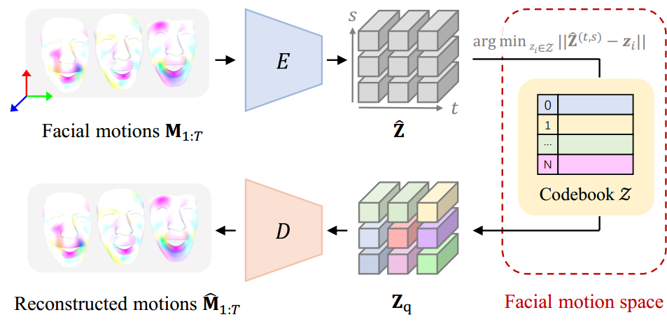

CodeTalker: Speech-Driven 3D Facial Animation with Discrete Motion Prior

### 
CVPR 2023
  

<a href="https://doubiiu.github.io" title="超链接title">Jinbo Xing</a>1, Menghan Xia2, Yuechen Zhang1, Xiaodong Cun2, Jue Wang2, Tien-Tsin Wong1
 

1The Chinese University of Hong Kong, 2Tencent AI Lab 

 
  
## Abstract
Speech-driven 3D facial animation has been widely studied, yet there is still a gap to achieving realism and vividness due to the highly ill-posed nature and scarcity of audio-visual data. 

## Method
### Discrete Motion Prior Learning
CodeTalker first learns a discrete context-rich facial motion codebook by self-reconstruction learning over real facial motions.   

     

<iframe height=480 width=480 src="May1.mp4"></iframe>

